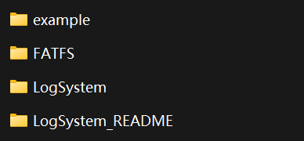

# LogSystem 使用说明

LogSystem是一个基于STM32和FatFS实现的、可以用于将数据记录在SD卡当中的简易日志系统代码库，其核心是FatFS文件系统，LogSystem只是对FatFS的源码做了进一步的封装。下图为LogSystem文件夹目录结构

其中：

- **example**：LogSystem代码库例程，基于大疆开发板A型板和STM32CubeMX。

- **FATFS**：FatFS文件系统源码

- **LogSystem**：LogSystem代码库，包含 LogSystem.c 和 LogSystem.h。

- **LogSystem_README**：LogSystem使用说明，使用Markdown编写，有着英文和中文两个版本。

## FatFS 简介

FatFS是一个适用于小型嵌入式设备的，开源的文件系统。下图为FatFS源码目录，版本为R0.12c。

其中：

- **option**：该文件夹中是一些可选的外部c文件，包含了多语言支持需要用到的文件和转换函数。

- **00history.txt**：记录了FatFS的版本更新情况。

- **00readme.txt**：介绍了该目录下的文件和文件夹的功能。

- **diskio.c**：包含了对底层存储介质的操作函数，需要根据不同的存储介质进行补全。

- **diskio.h**：定义了FatFs用到的宏，以及diskio.c文件内与底层硬件接口相关的函数声明。

- **ff.c**：文件管理的实现，包含着对文件进行操作的函数。

- **ff.h**：定义了ff.c文件内用到的宏和进行了相关函数的声明。

- **ff_gen_drv.c**：包含了通用的底层驱动函数。

- **ff_gen_drv.h**：ff_gen_drv.c的头文件。

- **ffconf.h**：FatFS的配置文件，定义了FatFS的相关配置参数.

- **ffconf_template.h**：ffconf.h的一个模板。

- **integer.h**：一些数值类型的定义。

- **st_readme.txt**：该文件列举了意法半导体公司对FatFS所做的与STM32集成的相关修改。

使用STM32CubeMX配置FatFS生成代码后，相应的文件夹目录会有些许不同，但是没有太大影响。

## STM32CubeMX 相关配置

首先点击左侧SYS，将Debug选项改为Serial Wire。

第二步，点击左侧RCC配置时钟源，点击High Speed Clock (HSE)，也就是高速时钟，选择Crystal/Ceramic Resonator。

第三步，配置时钟树，如下图所示。

第四步，点击左侧Connectivity，选择SDIO，将Mode改为SD 1 bit，接着，下半部分的Parameter Settings如下图所示。

第五步，点击左侧Middleware，选择FATFS，Mode方框内选择SD Card，User default可选可不选。

第六步，进入FATFS的Set Defines，根据下面两张图进行配置，也可以在阅读FATFS文件系统源码后，根据读者自身对这些宏的理解来配置。

第七步，FATFS的Advanced Settings如下图所示。

最后就是进入Project Manager，确定工程的位置，给工程命名，选择IDE或者编译工具，选择如何生成代码。

## 对STM32CubeMX生成的代码做一点修改

找到fatfs.c，做出如下图所示的修改

## 结语

LogSystem.c 和 LogSystem.h 都有相应的注释来解释代码。如果在使用过程中，读者认为LogSystem代码库有不足的地方，欢迎读者提出，也欢迎读者亲自出手来改进LogSystem。
