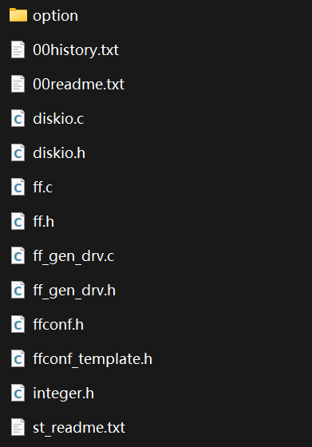
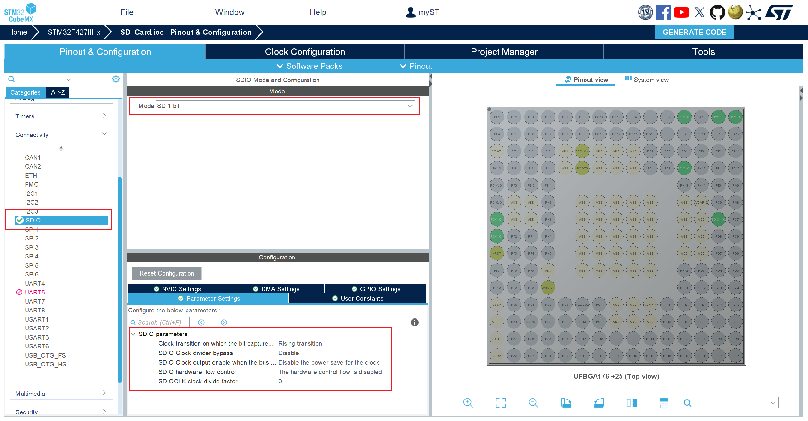
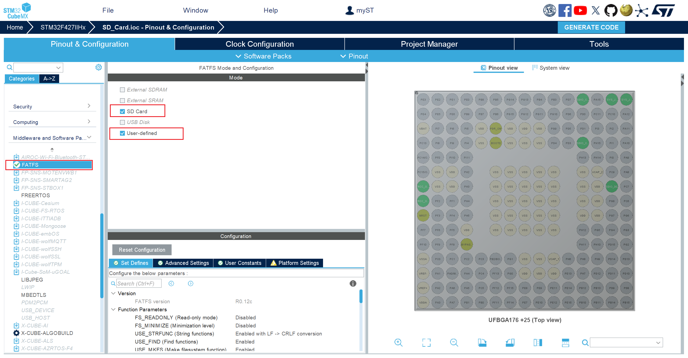
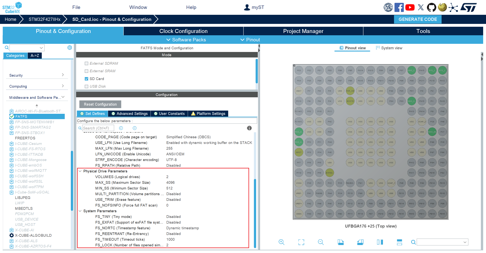

# LogSystem Instructions

LogSystem is achieved base on STM32 and FatFS, which can record data into SD card. FatFS is the core of LogSystem, and LogSystem is just a further encapsulation of FatFS source code. The following picture is the directory structure of the LogSystem folder.

In this file：

- **example**：The example of using LogSystem, which is based on STM32CubeMX and the A-board of DJI.
- **FATFS**：The source code of FatFS.
- **LogSystem**：The code of LogSystem, including LogSystem.c and LogSystem.h。
- **LogSystem_README**：LogSystem instructions，which is written by markdown and has Chinese version and English version.

## FatFS Introduction

FatFS is a file system which is suitable for small embedded devices and is open source. The following picture is the directory structure of FatFS source code folder, and its version is R0.12c.

In this file：

- **option**：This folder contains some optional external C files, including files and conversion functions required for multi-language support.
- **00history.txt**：This file records the version update of FatFS.
- **00readme.txt**：This file introduces the functions of the files and folders in this directory.
- **diskio.c**：This file contains the operating functions to the storage media of low-level, which is need to completed according to different storage media.
- **diskio.h**：This file defines the marcos which are used in FatFS, and the functions declarations of the interface related to low-level haraware in diskio.c.
- **ff.c**：The achievement of file management, including file operation functions.
- **ff.h**：This file defines the marcos which are used in ff.c and declares related functions.
- **ff_gen_drv.c**：This file contains general low-level driver functions.
- **ff_gen_drv.h**：The head file of ff_gen_drv.c.
- **ffconf.h**：The configuration file of FatFS, which defines the related parameters of FatFS.
- **ffconf_template.h**：A template of ffconf.h。
- **integer.h**：The Definitions of some numeric types.
- **st_readme.txt**：This file lists the main modification done by STMicroelectronics on FatFs for integration with STM32Cube solution.

After the code generation of STM32CubeMX, the folder directory maybe different, but there is not much impact.

## STM32CubeMX Configuration

Click "SYS" on left, and choose "Serial Wire" in "Debug".

Click "RCC" on left, click "High Speed Clock", choose "Crystal/Ceramic Resonator".

Config the clock tree.

Click "Connectivity" on left, choose "SDIO", choose "SD 1 bit" in "Mode", and set the parameters in "Parameters Setting".

Click "Middleware" on left, choose "FATFS", choose "SD card" in "Mode". "User-defined" is optional.

Enter the "Set Defines" of FATFS, config parameters according to the following two pictures. You can also config parameters after reading the source code of FatFS, based on the understanding of yourself.

Advanced Settings.

Enter "Project Manager"，determine the location of the project, name the project, select an IDE or compilation tool, and choose how to generate code.

## Make some modifications to the code generated by STM32CubeMX

Find fatfs.c, and modify it like the following picture.

## End

LogSystem.c and LogSystem.h both have corresponding comments to explain the code. If you think there are deficiencies in the LogSystem code library during use, you are welcome to point them out, and you are also welcome to improve LogSystem yourself.
